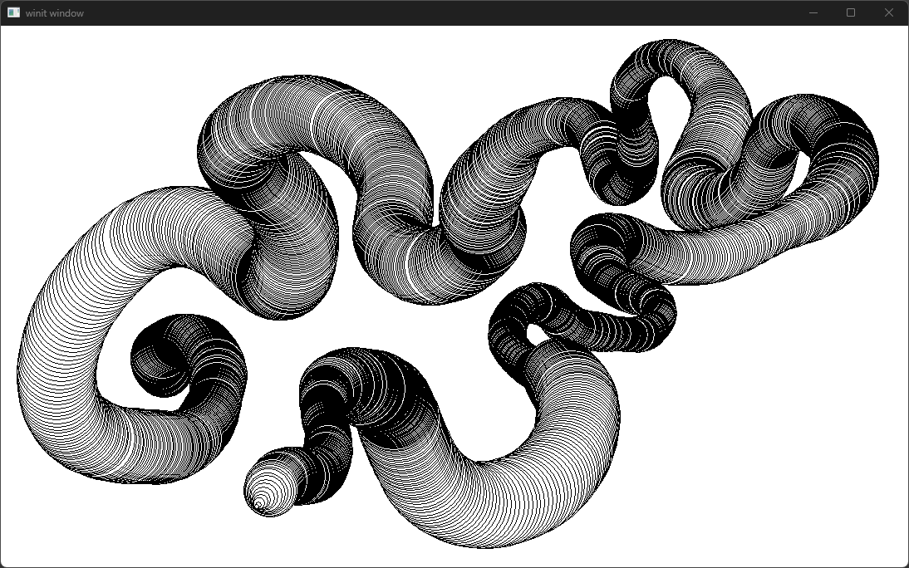

# Wintab; Lite-ly Rusted <!-- omit in toc -->

Defines a minimal set of types to get rust working with wintab.

- [1. Licence](#1-licence)
- [2. Examples](#2-examples)
  - [2.1. Using `winit` and the `libloading` feature](#21-using-winit-and-the-libloading-feature)
  - [2.2. Using `windows` and the `raw-dylib` feature](#22-using-windows-and-the-raw-dylib-feature)
- [3. Limitations](#3-limitations)
- [4. Alternatives](#4-alternatives)
  - [4.1. `bindgen` with `wintab.h`](#41-bindgen-with-wintabh)
  - [4.2. `octotablet` crate](#42-octotablet-crate)


## 1. Licence

The original wintab headers and documentation are marked with a copyright notice by Wacom.
See [here](https://github.com/Wacom-Developer/wacom-device-kit-windows/blob/881d8e8303e858e53584e70235fe32e3c9ef06f2/Wintab%20Pressure%20Test/SampleCode/Wintab/WINTAB.H#L1C1-L10C81)
and [here](https://developer-docs.wacom.com/docs/icbt/windows/wintab/wintab-reference/).
The example code provided by Wacom is MIT licensed [here](https://github.com/Wacom-Developer/wacom-device-kit-windows/blob/881d8e8303e858e53584e70235fe32e3c9ef06f2/Wintab%20Pressure%20Test/SampleCode/MIT-license.txt)

## 2. Examples

### 2.1. Using `winit` and the `libloading` feature

```bash
cargo run --example winit_libloading --features="libloading"
```

Usage:

- Press `space` on the keyboard to clear the view.
- Only wintab input will cause anything to be drawn. Mouse won't do anything.



Notes:

-When working in `winit`, the native `wintab` events (e.g. `WT_PACKET`) are
  unavailable.
  - Luckily `wintab` supports polling methods and keeps a nice timestamped event
    queue. YOu only need access to the `hwnd` pointer. This is good news as it
    means it is likely-ish I can get this working in `bevy`, as long as the
    plugin lets me have the `hwnd` :P
  - The `winit` project is in the process of overhauling how the event loop
    works. Hopefully they see fit to make `lparam` and `wparam` available in the new
    system.

### 2.2. Using `windows` and the `raw-dylib` feature

```bash
cargo run --example windows_raw_dylib --features="raw-dylib"
```

Usage:

- Press `space` on the keyboard to clear the view.
- Only wintab input will cause anything to be drawn. Mouse won't do anything.

Notes:

- links to "Wintab32.dll" at compile time using
  `#[link(name="Wintab32", kind = "raw-dylib")]`
  - This is nice because it drastically simplifies the use of extern functions in your code
  - But it means that it can only be compiled on a windows system with
    Wintab32.dll installed, and if Wintab32 becomes unavailable then your
    software will crash instead of being able to launch and deliver a meaningful
    error message to your user.
  - This is probably the way to go for hacky personal projects. I think
    libloading is the way to go for most other things.
- The call to
  `SetProcessDpiAwarenessContext(DPI_AWARENESS_CONTEXT_PER_MONITOR_AWARE)` is
  critical to avoid hours of painful debugging scaling problems!

## 3. Limitations

- Not all foreign functions are ported.
  - For example `WTEnable` is currently missing but I will probably add it in a
    future update.
  - `WTMgrOpen` is missing, but I can't be bothered adding it, because I think it
    is not needed unless you are writing a config tool for your tablet device,
    or doing really weird advanced stuff. PRs welcome though.
- `libloading` is not necessarily the best option... there are a few others out
  there. I would like to find a way to support any of them but I am not sure how.
- The examples worked for me with my hardware, however I didn't try to strictly
  follow all guidance in the docs, so edge cases and other hardware may need
  some extra code to properly configure the LOGCONTEXT object.
  - For example; I found that the default LOGCONTEXT object was mostly already
    configured as needed. The documentation gave me the impression that more
    setup steps should be needed; for example manually measuring the size of the
    virtual screen and using that to configure the `LOGCONTEXT` object. HOwever
    I found that the LOGCONTEXT object generally arrives pre-configured
    correctly, so much of the setup in the examples is possibly redundant. Or
    perhaps it is worth doing to ensure consistency across different hardware?


## 4. Alternatives

### 4.1. `bindgen` with `wintab.h`
An alternative to this crate is to use
[bindgen](https://crates.io/crates/bindgen) and the original `wintab.h` header
files which are avaliable
[here](https://github.com/Wacom-Developer/wacom-device-kit-windows). I did not
have a good time with that approach

 - A lot of excess code gets generated
 - Missing useful trait definitions
 - Coordinates are represented as separate struct fields instead of being packed
   into an `XYZ` struct
 - Enums are represented as separate const declarations instead of being a rust
   `enum` or using the `bitflags` crate.

### 4.2. `octotablet` crate

Please check out the [octotablet](https://crates.io/crates/octotablet/0.1.0)
project. At the time of writing it is the goal of this crate to be wrapped by
`octotablet`. Currently `octotablet` already provides Windows Ink functionality
and support for other platforms.

I did not have good results with windows Ink on my windows 11 machine, and
therefore I started work on this crate.
